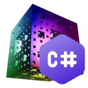

# ManifoldNET



C# binding for [Manifold](https://github.com/elalish/manifold).

Manifold is a geometry library dedicated to creating and operating on manifold triangle meshes. A manifold mesh is a mesh that represents a solid object, and so is very important in manufacturing, CAD, structural analysis, etc. 

# Nuget package 📦

## [ManifoldNET](https://www.nuget.org/packages/ManifoldNET)

Default package that cannot export glb file!


## [ManifoldNET.MeshIO](https://www.nuget.org/packages/ManifoldNET.MeshIO)

Support export to glb file.


## [Manifold.Notebooks](https://www.nuget.org/packages/ManifoldNET.Notebooks)

Packages which you can use it in VS Code Polyglot.


# Quick start 🚀

> dotnet add package ManifoldNET.MeshIO

```c#
using ManifoldNET;

Manifold cube = Manifold.Cube(1, 1, 1, true);
```

# Notebooks 📓

> You can quickly experience the usage of ManifoldNET through notebooks.

* [01.GetStarted.ipynb](./notebooks/01.GetStarted.ipynb)
* [02.Extrude.ipynb](./notebooks/02.Extrude.ipynb)
* [03.Revolve.ipynb](./notebooks/03.Revolve.ipynb)
* [04.CubeWithDents.ipynb](./notebooks/04.CubeWithDents.ipynb)
* [05.Bricks.ipynb](./notebooks/05.Bricks.ipynb)
* [06.GyroidModule.ipynb](./notebooks/06.GyroidModule.ipynb)
* [07.Maze.ipynb](./notebooks/07.Maze.ipynb)


> Requirements: C# notebooks require .NET 8 and the VS Code Polyglot extension.

# References 🔗

[Manifold](https://github.com/elalish/manifold).

[P/Invoke](https://learn.microsoft.com/zh-cn/dotnet/standard/native-interop/)
